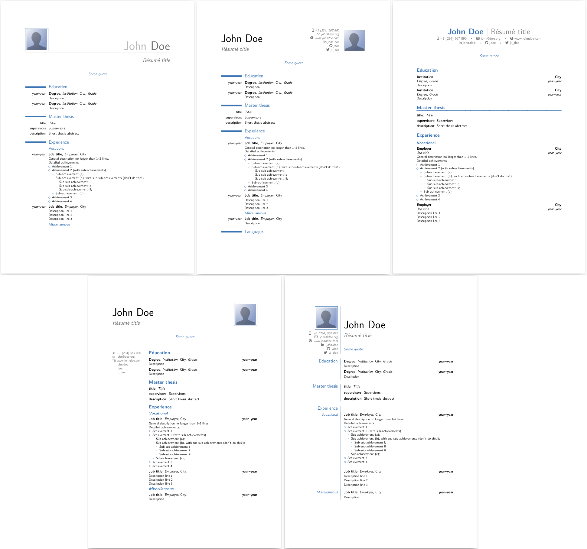

---
cross_posts:
  DEV: https://dev.to/nottrobin/how-to-build-and-customise-moderncv-on-ubuntu-2304-gfn
  Hacker News: https://news.ycombinator.com/item?id=37132572
date: 2023-08-15
description: I'm redoing my CV, and I've decided to use the ModernCV LaTeX template
email_campaign_id: b6f8d559b3
title: How to build and customise ModernCV on Ubuntu 23.04
---

[ModernCV](https://github.com/moderncv) is a customisable LaTeX CV template for creating your résumé, with 5 basic themes.



You can edit it directly and for free [on Overleaf](https://www.overleaf.com/latex/templates/moderncv-and-cover-letter-template/sttkgjcysttn), and if you're a beginner this is probably the way to go. There are also [many other CV templates available on Overleaf](https://www.overleaf.com/latex/templates/tagged/cv), although personally I find ModernCV the most elegant overall.

But the version on there is not as customisable as the full source code. So here I'm going to write down how to download, build and customise the original source code on Ubuntu 23.04, as I do it.

## Prerequisites

First, install LaTeX on Ubuntu:

``` bash
sudo apt update
sudo apt install -y latexmk texlive-latex-extra texlive-fonts-extra git
```

The pages we're installing are:

- [LatexMK](https://mg.readthedocs.io/latexmk.html): A smart compiler for LaTeX documents. It wraps and makes use of [pdflatex](https://www.math.rug.nl/~trentelman/jacob/pdflatex/pdflatex.html). It's better than using pdflatex yourself because it will manage any recompiltions and further steps automatically.
- [texlive-latex-extra](https://packages.debian.org/sid/texlive-latex-extra): This contains the etoolbox package, which is needed for most things including ModernCV.
- [texlive-fonts-extra](https://packages.debian.org/sid/texlive-fonts-extra): This contains [fontawesome5](https://ctan.org/pkg/fontawesome5?lang=en), used by ModernCV.
- [Git](https://github.com/git-guides/install-git): You need this to clone ModernCV, if you don't have it.

## Build the template ModernCV

Now clone the ModernCV project and build the template CV to check it's working:

``` bash
git clone https://github.com/moderncv/moderncv  # Get the code
cv moderncv  # Enter the project
latexmk -pdf ./template.tex  # Build the template
```

If it succeeded, you should see something like this at the bottom of the output:

```
Output written on template.pdf (6 pages, 351459 bytes).
Transcript written on template.log.
Latexmk: Getting log file 'template.log'
Latexmk: Examining 'template.fls'
Latexmk: Examining 'template.log'
Latexmk: Found input bbl file 'template.bbl'
Latexmk: Log file says output to 'template.pdf'
Latexmk: Found bibliography file(s):
  ./publications.bib
Latexmk: All targets () are up-to-date
```

And if you open up `template.pdf` you should now see an example CV for "John Doe".

If you get errors in compiling the PDF, firstly try running it again, or try deleting the directory, cloning it again, and then running if again. If that fails, try copying any error messages into Google to see if you can discover if you can fix the error by installing more `texlive` packages. It's possible installing [textlive-full](https://packages.debian.org/buster/texlive-full) may help.

## Customise the CV

To customise the CV for your own purposes, you should first copy `template.tex` to make your own `.tex` file for your CV, and then open that file and start editing it.

``` bash
cp template.tex yourname.tex  # Make a copy
code yourname.tex  # I like to use VSCode for editing, but you do you
```

The first thing you should probably do is go down to where it says "John Doe" and change it to your name:

``` latex
\name{John}{Doe}
```

Once you've made a couple of changes, try building and opening your CV:

``` bash
latexmk -pdf ./yourname.tex
xdg-open yourname.pdf
```

To compile your CV again, you'll need to delete the old PDF first:

``` bash
rm yourname.pdf
latexmk -pdf ./yourname.tex
```

## Customising

If you're happy with the theme, you can simply make changes to the pieces of content, move them around to suit your information, and you're done. But if you want to make deeper changes, that's also possible.

The file has liberal comments to explain to you how to make changes to it.

```latex
\documentclass[11pt,a4paper,sans]{moderncv}        % possible options include font size ('10pt', '11pt' and '12pt'), paper size ('a4paper', 'letterpaper', 'a5paper', 'legalpaper', 'executivepaper' and 'landscape') and font family ('sans' and 'roman')

% moderncv themes
\moderncvstyle{classic}                            % style options are 'casual' (default), 'classic', 'banking', 'oldstyle' and 'fancy'
\moderncvcolor{blue}                               % color options 'black', 'blue' (default), 'burgundy', 'green', 'grey', 'orange', 'purple' and 'red'
%\renewcommand{\familydefault}{\sfdefault}         % to set the default font; use '\sfdefault' for the default sans serif font, '\rmdefault' for the default roman one, or any tex font name
%\nopagenumbers{}                                  % uncomment to suppress automatic page numbering for CVs longer than one page

% adjust the page margins
\usepackage[scale=0.75]{geometry}
\setlength{\footskip}{149.60005pt}                 % depending on the amount of information in the footer, you need to change this value. comment this line out and set it to the size given in the warning
%\setlength{\hintscolumnwidth}{3cm}                % if you want to change the width of the column with the dates
%\setlength{\makecvheadnamewidth}{10cm}            % for the 'classic' style, if you want to force the width allocated to your name and avoid line breaks. be careful though, the length is normally calculated to avoid any overlap with your personal info; use this at your own typographical risks...
```

First it's worth playing around with the different themes. Try switching between "casual", "classic", "banking", "oldstyle" and "fancy".

The actual themes are defined in the `moderncvstyle*.sty` files. You can make changes to these or create new styles of your own if you like - for example, [the "classic" style with the "banking" header](https://tex.stackexchange.com/questions/176391/merging-banking-and-classic-style-in-moderncv).

You may well also want to change the margins. This can be done by changing the `\usepackage[scale=0.75]{geometry}` line. That number represents the amount of you page you want to dedicate to the text (`0.75` by default), so to reduce the margins, change the number towards `1`. I personally chose `0.85`.

I'm not going to explain all of how to edit the `.tex` file, as it's mostly explained inline. You can also learn more about LaTeX format itself [on Overleaf](https://www.overleaf.com/learn/latex/Learn_LaTeX_in_30_minutes) or [on freecodecamp.org](https://www.freecodecamp.org/news/learn-latex-full-course/).
